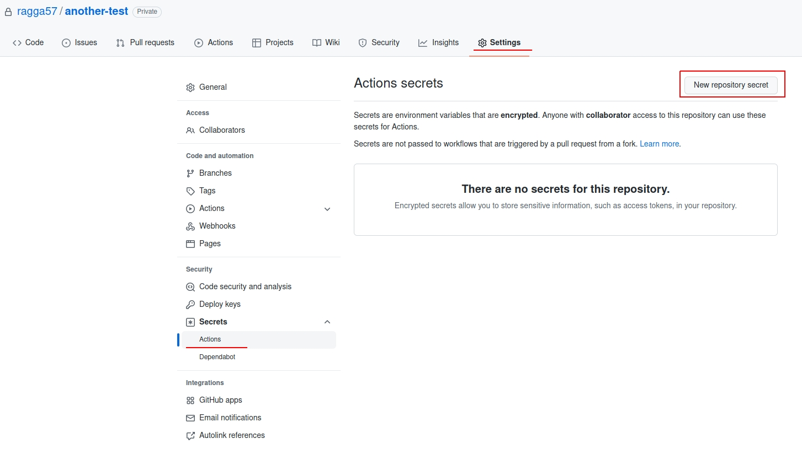
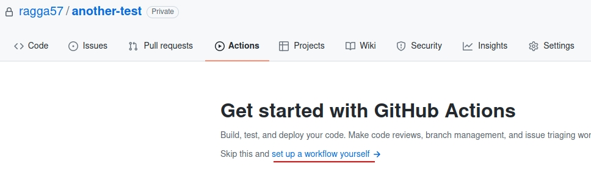
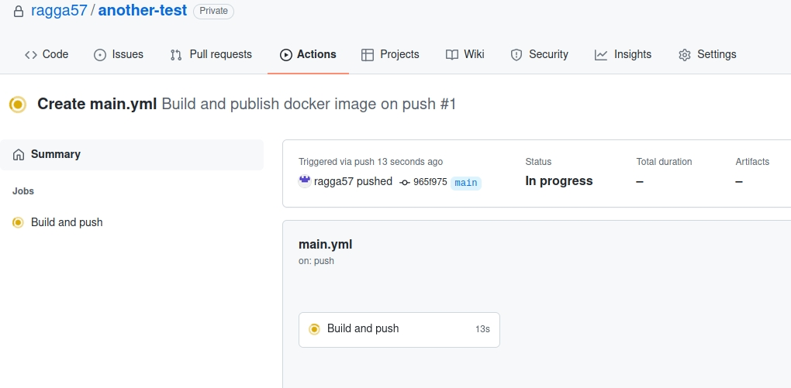
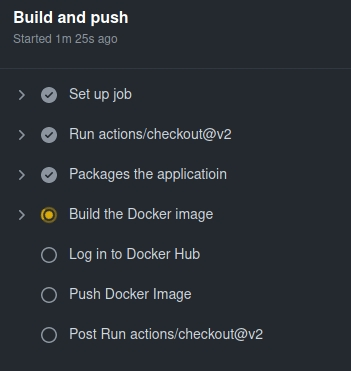
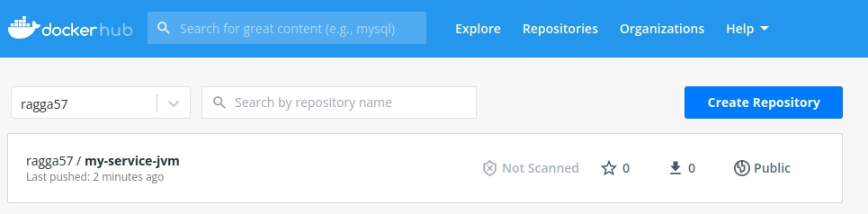
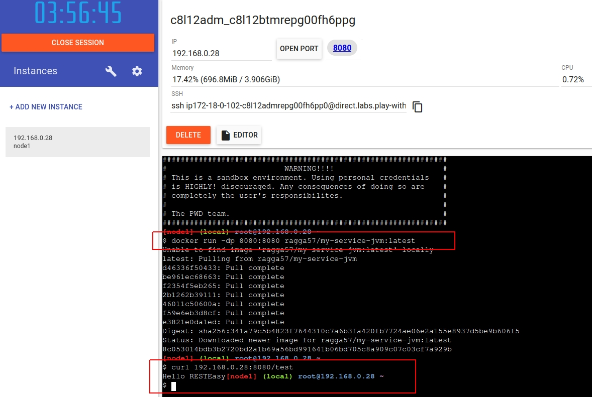

# Continuous integration demonstration

In this exercise we are going to build our own continuous integration pipeline for a simple Quarkus service
using GitHub actions.
This pipeline is going to
package our service, build docker image and push it to docker repository,
everytime there is a new push to the main branch.


That way the latest version of your application is always ready for deployment anywhere in the world.

#### What you are going to need
- [GitHub](https://github.com/) account
- [Docker hub](https://hub.docker.com/) account
- basic knowledge of `git` commands
## Initial setup

First create all the necessary accounts if you don't have them already.

Now either fork the following repository or copy its contents to your own new repository  

    https://github.com/ragga57/another-test.git

Inside this repository there is a simple quarkus service called `my-service` with `/test` endpoint.
This service and all the files inside were generated by [Quarkus](https://quarkus.io/get-started/).
Feel free to look inside.

## GitHub Actions

GitHub Actions are a way how to automate building, testing and deployment of your applications.

Go to the webpage of your repository.

We are going to be using `DockerHub` and for that we need to save our logging credentials in the repository,
preferably in an encrypted way.

Go to `Settings` -> `Secrets` -> `Actions` and create two new secrets:



- `DOCKER_USERNAME` with your DockerHub username
- `DOCKER_PASSWORD` with your DockerHub password

Now that we have our secrets ready, we can start with the interesting part

Click the `Actions` tab in the navigation bar.
You can see `Workflows` section. Workflows are sets of commands that GitHub is going to run everytime some even occurs.
You can have many different workflows for different use cases, but we going to create just one.

Click  `set up a workflow yourself`.



Workflows are written in `YAML` format.

Replace the initial contents with the following:

```yaml
# How the workflow is going to be called
name: Build and publish docker image on push

# On what event this workflow is going to be launched
on:
  push:
    branches: [ main ]

# There can be multiple jobs
jobs:
  # Only one job called build
  build:
    name: Build and push
    runs-on: ubuntu-latest

    # What steps are going be used
    steps:
    - uses: actions/checkout@v2
    - name: Packages the applicatioin
      run: |
          cd my-service
          ./mvnw package   
    
    - name: Build the Docker image
      run: |
          cd my-service
          docker build -f src/main/docker/Dockerfile.jvm -t ${{ secrets.DOCKER_USERNAME }}/my-service-jvm .  
    
    - name: Log in to Docker Hub
      uses: docker/login-action@f054a8b539a109f9f41c372932f1ae047eff08c9
      with:
        username: ${{ secrets.DOCKER_USERNAME }}
        password: ${{ secrets.DOCKER_PASSWORD }}
    
    - name: Push Docker Image
      run: |
        docker push ${{ secrets.DOCKER_USERNAME }}/my-service-jvm:latest
```
There is a lot of going on here so let's dissect it.

The first `name` is name of our workflow. The `on` keyword tells GitHub Actions when we want to run this workflow.
In our case it is everytime there is a push to main branch.

Each workflow can have multiple jobs. In our case there is only one job called **build**.
Each job has steps it needs to complete.

`Uses` is a special keyword for already prepared actions such as login to various services,
checking and committing changes and many more.

`run` are the actual bash commands we want to run

First step of our job is to build package our application. This step also runs unit tests.

Once the application is packaged, `docker build` is being used to create the docker image.
The format ``DOCKER_USERNAME/IMAGE_NAME`` is important as this lets us easily publish images to the right 
repository.

Next step is to log in to the DockerHub using our secrets we created earlier.

Last step is to push it image. Notice the `:latest`. This is called a tag and every image needs one.

Commit this workflow.

Notice that since this is push action to the main branch this new workflow
is immediately used. 




You can click on the workflow to se the progress.



After minute of two all steps should be completed and your new image uploaded.

Go check it out in the DockerHub.



We can now launch this image anywhere thanks to Docker.

Go to the following website [PlayWithDocker](https://labs.play-with-docker.com/). The login credentials are the same
as the **DockerHub** credentials.

You can download and run your newly created using:

    docker run -dp 8080:8080 DOCKER-USERNAME/my-service-jvm:latest

After the initial download try by running: 

    curl YOUR-GIVEN-IP-ADDRESS:8080/test

If the reply is **"Hello RESTEasy"** then congratulations, your new service is ready and up and running.




 

